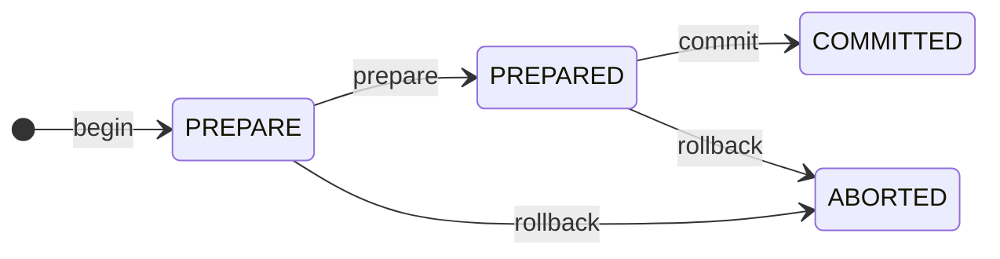

# 使用 Stream Load 事务接口导入数据

import InsertPrivNote from '../_assets/commonMarkdown/insertPrivNote.mdx'

从 v2.4 版本开始，StarRocks 提供了一个 Stream Load 事务接口，用于为从外部系统（如 Apache Flink® 和 Apache Kafka®）加载数据的事务实现两阶段提交 (2PC)。Stream Load 事务接口有助于提高高并发流式导入的性能。

从 v4.0 版本开始，Stream Load 事务接口支持多表事务，即在同一数据库中将数据导入到多个表中。

本主题介绍 Stream Load 事务接口，以及如何使用此接口将数据导入到 StarRocks 中。

## 描述

Stream Load 事务接口支持使用与 HTTP 协议兼容的工具或语言来调用 API 操作。本主题以 curl 为例，说明如何使用此接口。此接口提供各种功能，例如事务管理、数据写入、事务预提交、事务去重和事务超时管理。

:::note
Stream Load 支持 CSV 和 JSON 文件格式。如果要从少量文件（单个文件大小不超过 10 GB）加载数据，建议使用此方法。Stream Load 不支持 Parquet 文件格式。如果需要从 Parquet 文件加载数据，请使用 [INSERT+files()](../loading/InsertInto.md#insert-data-directly-from-files-in-an-external-source-using-files) 。
:::

### 事务管理

Stream Load 事务接口提供以下 API 操作，用于管理事务：

- `/api/transaction/begin`: 启动一个新事务。

- `/api/transaction/prepare`: 预提交当前事务，并使数据更改暂时持久化。预提交事务后，您可以继续提交或回滚事务。如果您的集群在事务预提交后崩溃，您仍然可以在集群恢复后继续提交事务。

- `/api/transaction/commit`: 提交当前事务以使数据更改持久化。

- `/api/transaction/rollback`: 回滚当前事务以中止数据更改。

> **NOTE**
>
> 事务预提交后，请勿继续使用该事务写入数据。如果继续使用该事务写入数据，您的写入请求将返回错误。

下图显示了事务状态和操作之间的关系：



### 数据写入

Stream Load 事务接口提供 `/api/transaction/load` 操作，用于写入数据。您可以在一个事务中多次调用此操作。

从 v4.0 版本开始，您可以对不同的表调用 `/api/transaction/load` 操作，以将数据加载到同一数据库中的多个表中。

### 事务去重

Stream Load 事务接口沿用了 StarRocks 的标签机制。您可以将唯一标签绑定到每个事务，以实现事务的至多一次保证。

### 事务超时管理

启动事务时，可以使用 HTTP 请求头中的 `timeout` 字段指定事务从 `PREPARE` 到 `PREPARED` 状态的超时时间（以秒为单位）。如果事务在此时间段后仍未准备好，则会自动中止。如果未指定此字段，则默认值由 FE 配置 [`stream_load_default_timeout_second`](../administration/management/FE_configuration.md#stream_load_default_timeout_second) 确定（默认值：600 秒）。

启动事务时，您还可以使用 HTTP 请求头中的 `idle_transaction_timeout` 字段指定事务可以保持空闲的超时时间（以秒为单位）。如果在此期间未写入任何数据，则事务将自动回滚。

准备事务时，可以使用 HTTP 请求头中的 `prepared_timeout` 字段指定事务从 `PREPARED` 到 `COMMITTED` 状态的超时时间（以秒为单位）。如果事务在此时间段后仍未提交，则会自动中止。如果未指定此字段，则默认值由 FE 配置 [`prepared_transaction_default_timeout_second`](../administration/management/FE_configuration.md#prepared_transaction_default_timeout_second) 确定（默认值：86400 秒）。v3.5.4 及更高版本支持 `prepared_timeout`。

## 优势

Stream Load 事务接口具有以下优势：

- **Exactly-once 语义**

  事务分为两个阶段：预提交和提交，这使得跨系统加载数据变得容易。例如，此接口可以保证从 Flink 加载数据的 exactly-once 语义。

- **提高导入性能**

  如果您使用程序运行导入作业，则 Stream Load 事务接口允许您根据需要合并多个小批量数据，然后通过调用 `/api/transaction/commit` 操作在一个事务中一次性发送所有数据。这样，需要加载的数据版本更少，并且导入性能得到提高。

## 限制

Stream Load 事务接口具有以下限制：

- 从 v4.0 版本开始，支持**单数据库多表**事务。对**多数据库多表**事务的支持正在开发中。

- 仅支持**来自一个客户端的并发数据写入**。对**来自多个客户端的并发数据写入**的支持正在开发中。

- `/api/transaction/load` 操作可以在一个事务中多次调用。在这种情况下，为调用的所有 `/api/transaction/load` 操作指定的参数设置（`table` 除外）必须相同。

- 当您使用 Stream Load 事务接口加载 CSV 格式的数据时，请确保数据文件中的每个数据记录都以行分隔符结尾。

## 注意事项

- 如果您调用的 `/api/transaction/begin`、`/api/transaction/load` 或 `/api/transaction/prepare` 操作返回错误，则事务失败并自动回滚。
- 调用 `/api/transaction/begin` 操作以启动新事务时，必须指定标签。请注意，后续的 `/api/transaction/load`、`/api/transaction/prepare` 和 `/api/transaction/commit` 操作必须使用与 `/api/transaction/begin` 操作相同的标签。
- 如果您使用正在进行的事务的标签来调用 `/api/transaction/begin` 操作以启动新事务，则先前的事务将失败并回滚。
- 如果您使用多表事务将数据加载到不同的表中，则必须为事务中涉及的所有操作指定参数 `-H "transaction_type:multi"`。
- StarRocks 支持的 CSV 格式数据的默认列分隔符和行分隔符是 `\t` 和 `\n`。如果您的数据文件未使用默认列分隔符或行分隔符，则必须使用 `"column_separator: <column_separator>"` 或 `"row_delimiter: <row_delimiter>"` 在调用 `/api/transaction/load` 操作时指定数据文件中实际使用的列分隔符或行分隔符。

## 前提条件

### 检查权限

<InsertPrivNote />

#### 检查网络配置

确保您要加载的数据所在的机器可以通过 [`http_port`](../administration/management/FE_configuration.md#http_port) （默认值：`8030`）和 [`be_http_port`](../administration/management/BE_configuration.md#be_http_port) （默认值：`8040`）访问 StarRocks 集群的 FE 和 BE 节点。

## 基本操作

### 准备示例数据

本主题以 CSV 格式的数据为例。

1. 在本地文件系统的 `/home/disk1/` 路径中，创建一个名为 `example1.csv` 的 CSV 文件。该文件由三列组成，依次表示用户 ID、用户名和用户分数。

   ```Plain
   1,Lily,23
   2,Rose,23
   3,Alice,24
   4,Julia,25
   ```

2. 在您的 StarRocks 数据库 `test_db` 中，创建一个名为 `table1` 的主键表。该表由三列组成：`id`、`name` 和 `score`，其中 `id` 是主键。

   ```SQL
   CREATE TABLE `table1`
   (
       `id` int(11) NOT NULL COMMENT "user ID",
       `name` varchar(65533) NULL COMMENT "user name",
       `score` int(11) NOT NULL COMMENT "user score"
   )
   ENGINE=OLAP
   PRIMARY KEY(`id`)
   DISTRIBUTED BY HASH(`id`) BUCKETS 10;
   ```

### 启动事务

#### 语法

```Bash
curl --location-trusted -u <username>:<password> -H "label:<label_name>" \
    -H "Expect:100-continue" \
    [-H "transaction_type:multi"]\  # 可选。启动多表事务。
    -H "db:<database_name>" -H "table:<table_name>" \
    -XPOST http://<fe_host>:<fe_http_port>/api/transaction/begin
```

> **NOTE**
>
> 如果要将数据加载到事务中的不同表中，请在命令中指定 `-H "transaction_type:multi"`。

#### 示例

```Bash
curl --location-trusted -u <jack>:<123456> -H "label:streamload_txn_example1_table1" \
    -H "Expect:100-continue" \
    -H "db:test_db" -H "table:table1" \
    -XPOST http://<fe_host>:<fe_http_port>/api/transaction/begin
```

> **NOTE**
>
> 在此示例中，`streamload_txn_example1_table1` 被指定为事务的标签。

#### 返回结果

- 如果事务成功启动，则返回以下结果：

  ```Bash
  {
      "Status": "OK",
      "Message": "",
      "Label": "streamload_txn_example1_table1",
      "TxnId": 9032,
      "BeginTxnTimeMs": 0
  }
  ```

- 如果事务绑定到重复标签，则返回以下结果：

  ```Bash
  {
      "Status": "LABEL_ALREADY_EXISTS",
      "ExistingJobStatus": "RUNNING",
      "Message": "Label [streamload_txn_example1_table1] has already been used."
  }
  ```

- 如果发生除重复标签之外的错误，则返回以下结果：

  ```Bash
  {
      "Status": "FAILED",
      "Message": ""
  }
  ```

### 写入数据

#### 语法

```Bash
curl --location-trusted -u <username>:<password> -H "label:<label_name>" \
    -H "Expect:100-continue" \
    [-H "transaction_type:multi"]\  # 可选。通过多表事务加载数据。
    -H "db:<database_name>" -H "table:<table_name>" \
    -T <file_path> \
    -XPUT http://<fe_host>:<fe_http_port>/api/transaction/load
```

> **NOTE**
>
> - 调用 `/api/transaction/load` 操作时，必须使用 `<file_path>` 指定要加载的数据文件的保存路径。
> - 您可以调用具有不同 `table` 参数值的 `/api/transaction/load` 操作，以将数据加载到同一数据库中的不同表中。在这种情况下，您必须在命令中指定 `-H "transaction_type:multi"`。

#### 示例

```Bash
curl --location-trusted -u <jack>:<123456> -H "label:streamload_txn_example1_table1" \
    -H "Expect:100-continue" \
    -H "db:test_db" -H "table:table1" \
    -T /home/disk1/example1.csv \
    -H "column_separator: ," \
    -XPUT http://<fe_host>:<fe_http_port>/api/transaction/load
```

> **NOTE**
>
> 在此示例中，数据文件 `example1.csv` 中使用的列分隔符是逗号 (`,`)，而不是 StarRocks 的默认列分隔符 (`\t`)。因此，在调用 `/api/transaction/load` 操作时，必须使用 `"column_separator: <column_separator>"` 指定逗号 (`,`) 作为列分隔符。

#### 返回结果

- 如果数据写入成功，则返回以下结果：

  ```Bash
  {
      "TxnId": 1,
      "Seq": 0,
      "Label": "streamload_txn_example1_table1",
      "Status": "OK",
      "Message": "",
      "NumberTotalRows": 5265644,
      "NumberLoadedRows": 5265644,
      "NumberFilteredRows": 0,
      "NumberUnselectedRows": 0,
      "LoadBytes": 10737418067,
      "LoadTimeMs": 418778,
      "StreamLoadPutTimeMs": 68,
      "ReceivedDataTimeMs": 38964,
  }
  ```

- 如果事务被认为是未知的，则返回以下结果：

  ```Bash
  {
      "TxnId": 1,
      "Label": "streamload_txn_example1_table1",
      "Status": "FAILED",
      "Message": "TXN_NOT_EXISTS"
  }
  ```

- 如果事务被认为处于无效状态，则返回以下结果：

  ```Bash
  {
      "TxnId": 1,
      "Label": "streamload_txn_example1_table1",
      "Status": "FAILED",
      "Message": "Transcation State Invalid"
  }
  ```

- 如果发生除未知事务和无效状态之外的错误，则返回以下结果：

  ```Bash
  {
      "TxnId": 1,
      "Label": "streamload_txn_example1_table1",
      "Status": "FAILED",
      "Message": ""
  }
  ```

### 预提交事务

#### 语法

```Bash
curl --location-trusted -u <username>:<password> -H "label:<label_name>" \
    -H "Expect:100-continue" \
    [-H "transaction_type:multi"]\  # 可选。预提交多表事务。
    -H "db:<database_name>" \
    [-H "prepared_timeout:<timeout_seconds>"] \
    -XPOST http://<fe_host>:<fe_http_port>/api/transaction/prepare
```

> **NOTE**
>
> 如果要预提交的事务是多表事务，请在命令中指定 `-H "transaction_type:multi"`。

#### 示例

```Bash
curl --location-trusted -u <jack>:<123456> -H "label:streamload_txn_example1_table1" \
    -H "Expect:100-continue" \
    -H "db:test_db" \
    -H "prepared_timeout:300" \
    -XPOST http://<fe_host>:<fe_http_port>/api/transaction/prepare
```

> **NOTE**
>
> `prepared_timeout` 字段是可选的。如果未指定，则默认值由 FE 配置 [`prepared_transaction_default_timeout_second`](../administration/management/FE_configuration.md#prepared_transaction_default_timeout_second) 确定（默认值：86400 秒）。v3.5.4 及更高版本支持 `prepared_timeout`。

#### 返回结果

- 如果预提交成功，则返回以下结果：

  ```Bash
  {
      "TxnId": 1,
      "Label": "streamload_txn_example1_table1",
      "Status": "OK",
      "Message": "",
      "NumberTotalRows": 5265644,
      "NumberLoadedRows": 5265644,
      "NumberFilteredRows": 0,
      "NumberUnselectedRows": 0,
      "LoadBytes": 10737418067,
      "LoadTimeMs": 418778,
      "StreamLoadPutTimeMs": 68,
      "ReceivedDataTimeMs": 38964,
      "WriteDataTimeMs": 417851
      "CommitAndPublishTimeMs": 1393
  }
  ```

- 如果事务被认为不存在，则返回以下结果：

  ```Bash
  {
      "TxnId": 1,
      "Label": "streamload_txn_example1_table1",
      "Status": "FAILED",
      "Message": "Transcation Not Exist"
  }
  ```

- 如果预提交超时，则返回以下结果：

  ```Bash
  {
      "TxnId": 1,
      "Label": "streamload_txn_example1_table1",
      "Status": "FAILED",
      "Message": "commit timeout",
  }
  ```

- 如果发生除不存在的事务和预提交超时之外的错误，则返回以下结果：

  ```Bash
  {
      "TxnId": 1,
      "Label": "streamload_txn_example1_table1",
      "Status": "FAILED",
      "Message": "publish timeout"
  }
  ```

### 提交事务

#### 语法

```Bash
curl --location-trusted -u <username>:<password> -H "label:<label_name>" \
    -H "Expect:100-continue" \
    [-H "transaction_type:multi"]\  # 可选。提交多表事务。
    -H "db:<database_name>" \
    -XPOST http://<fe_host>:<fe_http_port>/api/transaction/commit
```

> **NOTE**
>
> 如果要提交的事务是多表事务，请在命令中指定 `-H "transaction_type:multi"`。

#### 示例

```Bash
curl --location-trusted -u <jack>:<123456> -H "label:streamload_txn_example1_table1" \
    -H "Expect:100-continue" \
    -H "db:test_db" \
    -XPOST http://<fe_host>:<fe_http_port>/api/transaction/commit
```

#### 返回结果

- 如果提交成功，则返回以下结果：

  ```Bash
  {
      "TxnId": 1,
      "Label": "streamload_txn_example1_table1",
      "Status": "OK",
      "Message": "",
      "NumberTotalRows": 5265644,
      "NumberLoadedRows": 5265644,
      "NumberFilteredRows": 0,
      "NumberUnselectedRows": 0,
      "LoadBytes": 10737418067,
      "LoadTimeMs": 418778,
      "StreamLoadPutTimeMs": 68,
      "ReceivedDataTimeMs": 38964,
      "WriteDataTimeMs": 417851
      "CommitAndPublishTimeMs": 1393
  }
  ```

- 如果事务已提交，则返回以下结果：

  ```Bash
  {
      "TxnId": 1,
      "Label": "streamload_txn_example1_table1",
      "Status": "OK",
      "Message": "Transaction already commited",
  }
  ```

- 如果事务被认为不存在，则返回以下结果：

  ```Bash
  {
      "TxnId": 1,
      "Label": "streamload_txn_example1_table1",
      "Status": "FAILED",
      "Message": "Transcation Not Exist"
  }
  ```

- 如果提交超时，则返回以下结果：

  ```Bash
  {
      "TxnId": 1,
      "Label": "streamload_txn_example1_table1",
      "Status": "FAILED",
      "Message": "commit timeout",
  }
  ```

- 如果数据发布超时，则返回以下结果：

  ```Bash
  {
      "TxnId": 1,
      "Label": "streamload_txn_example1_table1",
      "Status": "FAILED",
      "Message": "publish timeout",
      "CommitAndPublishTimeMs": 1393
  }
  ```

- 如果发生除不存在的事务和超时之外的错误，则返回以下结果：

  ```Bash
  {
      "TxnId": 1,
      "Label": "streamload_txn_example1_table1",
      "Status": "FAILED",
      "Message": ""
  }
  ```

### 回滚事务

#### 语法

```Bash
curl --location-trusted -u <username>:<password> -H "label:<label_name>" \
    -H "Expect:100-continue" \
    [-H "transaction_type:multi"]\  # 可选。回滚多表事务。
    -H "db:<database_name>" \
    -XPOST http://<fe_host>:<fe_http_port>/api/transaction/rollback
```

> **NOTE**
>
> 如果要回滚的事务是多表事务，请在命令中指定 `-H "transaction_type:multi"`。

#### 示例

```Bash
curl --location-trusted -u <jack>:<123456> -H "label:streamload_txn_example1_table1" \
    -H "Expect:100-continue" \
    -H "db:test_db" \
    -XPOST http://<fe_host>:<fe_http_port>/api/transaction/rollback
```

#### 返回结果

- 如果回滚成功，则返回以下结果：

  ```Bash
  {
      "TxnId": 1,
      "Label": "streamload_txn_example1_table1",
      "Status": "OK",
      "Message": ""
  }
  ```

- 如果事务被认为不存在，则返回以下结果：

  ```Bash
  {
      "TxnId": 1,
      "Label": "streamload_txn_example1_table1",
      "Status": "FAILED",
      "Message": "Transcation Not Exist"
  }
  ```

- 如果发生除不存在的事务之外的错误，则返回以下结果：

  ```Bash
  {
      "TxnId": 1,
      "Label": "streamload_txn_example1_table1",
      "Status": "FAILED",
      "Message": ""
  }
  ```

## 相关参考

有关 Stream Load 的适用场景和支持的数据文件格式，以及 Stream Load 的工作原理的信息，请参见 [通过 Stream Load 从本地文件系统加载](../loading/StreamLoad.md#loading-from-a-local-file-system-via-stream-load)。

有关创建 Stream Load 作业的语法和参数的信息，请参见 [STREAM LOAD](../sql-reference/sql-statements/loading_unloading/STREAM_LOAD.md)。